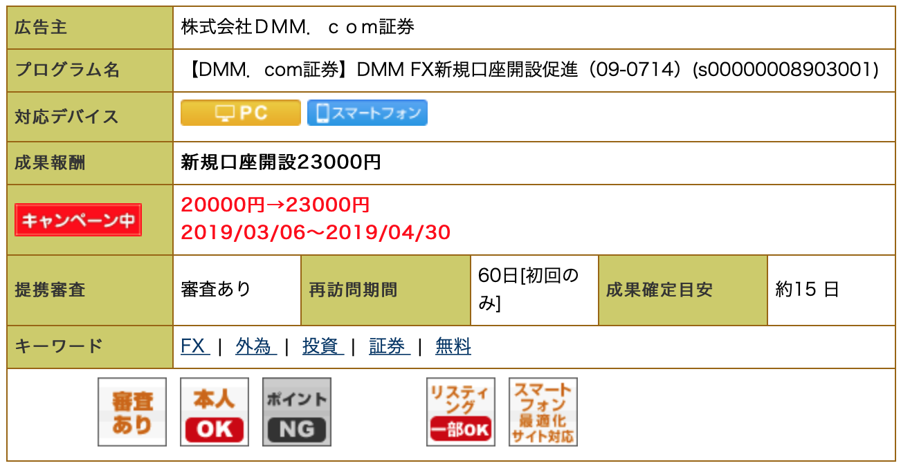

#TTさん_DM

TT(@dCwcjJbv7dv63en)さん

> 後でいただいたアカウントをブラックリストに登録したいので、管理のためにこのような形にしました
>
> ご了承ください！🙇‍♂️

これはもう" *詐欺とはなんなのか* "という話になるんですが、Maezawaは

​	**懸賞を利用して他のこと（サイト登録等）に誘導すること**

としています😃

つまり、例えば

​	「サイト登録をさせられたけど、ちゃんと賞金はもらえた」

っていうのは、詐欺だということです。

その前提で、お話をさせていただきます🙋‍♂️

##[須藤 有紗(ありさむ) ](https://twitter.com/arisa_happylc)

まず、須藤 有紗(ありさむ) さんですが、120パーセント詐欺です
このサイトが分かりやすいので引用させていただきます↓
http://ujijijitorend.com/2089.html

##りね

次にLINEのりねさんも、Maezawa基準では詐欺です。
もしかしたら本当でツールがもらえるのかもしれません。
しかし２つ考慮しなければいけないことがあります。

1. 儲かるツールがあるなら売らなくても儲かる。
2. **FXやバイナリ関係は広告報酬がとても高い！！！**

1.は考えれば当たり前ですが、2.が重要です。

見たほうが早いので、a8.netという広告会社のとある広告の詳細をご覧ください↓↓

相手が口座を開設して5万円入金することが条件ですが、なんと

**2万3000円**

がもらえます。

*このツール使ったらすぐ10倍になるよ〜*

とか言って、相手に口座を開設させるだけで**2万3000円**です。

このように報酬が高額なために、**FXやバイナリ関連は詐欺が多い**です。

##[千夏@元ローン地獄住人](https://twitter.com/mori_china_0904)

ここまでくれば、もうわかるのではないでしょうか。

この人も、FX関連のツールをブログで販売し、そのリンクをTwitterのプロフィールに貼っています。

さらに高額懸賞、ライン誘導と、怪しいところしかありません。

## まとめ

ここまで丁寧に書いたのは、ここにいない詐欺アカウントも見抜けるようになっていただきたいからです！

今日ご紹介したポイントを押さえれば、詐欺アカウントをかなり見抜けるはずです！！😊

最後にはなりますが、わざわざリプとDMを送っていただきありがとうございました！☺️

これからもよろしくお願いします！🙇‍♂️